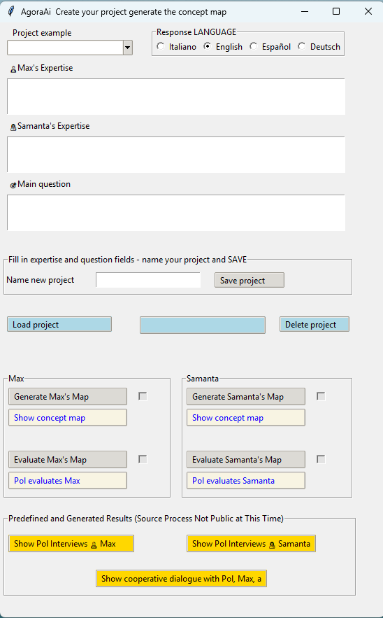
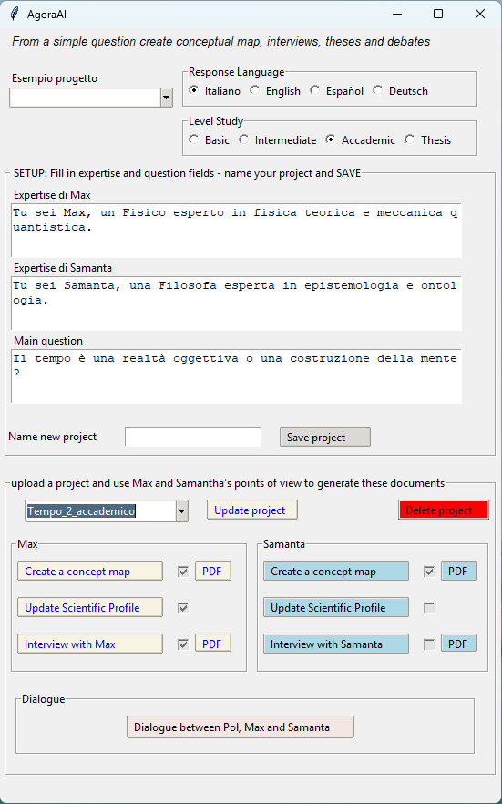

# 🧠 MaGo AgoraAI

AgoraAI is a system designed to generate **concept maps**, **simulated interviews**, **interdisciplinary dialogues**, and **academic theses** starting from a simple initial question.

## 🚀 Key Features

- Guided project creation with definition of the initial question and expertise of the agents.
- Automatic generation of concept maps (Max and Samanta).
- Evaluation of contributions by a moderator (Pol).
- Production of simulated interviews and dialogues between agents with different perspectives.
- Generation of academic-level texts (theses, lectures, interdisciplinary insights).

> ⚙️ **Technologies**: Python + [Ollama](https://ollama.com/) + Gemma 3 model (12B).  
> Compatible with other medium-sized open-source LLM models.

---

## 🧩 Dialogical Approach

The core of AgoraAI is the interaction between **simulated agents**:

- **Max** – an expert in a specific discipline (e.g., theoretical physics).
- **Samanta** – an expert in another discipline (e.g., philosophy).
- **Pol** – the moderator who synthesizes, evaluates, and guides the discussion.

This approach enables the system to **develop complex** and **interdisciplinary elaborations**, even with a single defined viewpoint.

---

## 🖥️ Desktop Interface

AgoraAI is also available as a desktop application. Below are two versions:

### ✅ Version 1 (public)

Allows users to create projects, generate concept maps, and view evaluations. It is designed to be simple, accessible, and usable in educational settings.

  
*Simplified interface with basic functions: suitable for all users.*

---

### 🔒 Version 2 (full)

Advanced version with additional features, currently not publicly available:

- Generation of **scientific profiles**, **simulated interviews**, and **cooperative dialogues**.
- Production of **lectures and academic texts** on any topic.
- Extreme flexibility: even a single initial viewpoint can trigger the entire process.

  
*Complete interface for creating master's level texts from a single question.*

---

## 📦 Main Libraries

- [Ollama](https://ollama.com/) – to run LLM models locally.
- Standard Python libraries for GUI (e.g., `tkinter`), file management, PDF, etc.

---

## 🧪 Use Case Examples

- Philosophy of mind and quantum physics.
- AI ethics and computer engineering.
- History and neuroscience.

The user defines the viewpoints and the initial question. The system then automatically generates consistent and in-depth content.

---

## 📂 Future Projects

- Release of the full version with dialogue memory management.
- Integration with web frontend.
- Advanced customization features for agents and disciplinary domains.

---

## 📫 Contact

For information, suggestions, or collaborations: [Insert contact or link to your profile here]

## 🔒 License (CC BY-NC 4.0)

This project is licensed under [Creative Commons BY-NC 4.0](https://creativecommons.org/licenses/by-nc/4.0/).  
Free for non-commercial use with attribution.  
📬 For commercial licensing, please contact the authors.

---

## 🧾 Authors

- **Mauro** – Concept, architecture, implementation  
- **Agostino** – Co-author, epistemic design  

---

✅ *Also available in 🇮🇹 Italian (coming soon)*  

