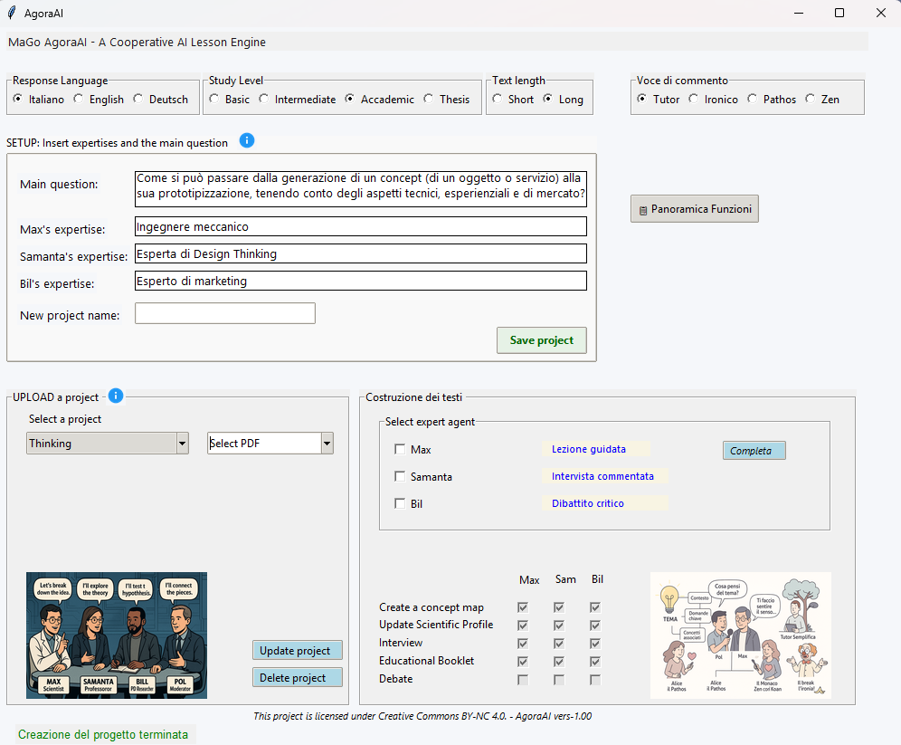

# 🧠 MaGo‑AgoraAI

**Un sistema multi-agente locale per generare mappe concettuali, interviste simulate e testi accademici interdisciplinari — a partire da una singola domanda.**  
🎯 *Il primo strumento open per un discorso accademico cooperativo, multilingue e multi-agente.*

---

## 🚀 Scarica AgoraAI v1.0 (.exe)

🎉 **La prima versione ufficiale è disponibile!**

👉 [**Scarica AgoraAI v1.0**](https://drive.google.com/uc?export=download&id=1PS9eNMUcnWsSeSIBwsZooD0pZxIfD5Gf)

🚀 AgoraAI v1.0 – Versione Ottimizzata Disponibile!
🎉 La prima versione ufficiale evolve: più leggera, più accessibile, più intelligente.

#🧠 Funziona 100% in locale con Ollama + modelli Gemma 3B/12B (e ora anche modelli più piccoli, leggeri ma sorprendentemente efficaci).
Niente cloud, niente API, nessun token.
🔧 Novità principali:

    ⚙️ Ottimizzazione generale delle prestazioni

    🧩 Accesso a modelli più piccoli: testati e selezionati per ottimi risultati anche su hardware meno recente

    💻 Compatibilità estesa: ora funziona anche su schede grafiche RTX serie 2000

    🖨️ Corretto un conflitto nella stampa PDF: i documenti sono ora accessibili anche nei formati Markdown e HTML

    🧭 Nuovo avvio intelligente: non solo puoi iniziare ponendo una domanda, ma anche descrivendo un problema.
    Da lì, gli agenti del modello generano autonomamente la domanda iniziale e i punti di vista specialistici per avviare il percorso di studio.

📌 AgoraAI è il tuo spazio di dialogo cognitivo: una piattaforma offline per esplorare idee, risolvere problemi, simulare punti di vista esperti.

🧪 Sperimenta. Confronta. Approfondisci

---

## 🖼 Anteprima Interfaccia

---

## 🔍 Cos’è MaGo‑AgoraAI?

MaGo‑AgoraAI è un innovativo **motore educativo multi-agente** che genera:

- 🧠 **Dibattiti simulati** con 3–4 agenti AI a livello accademico  
- 🗺️ **Mappe concettuali** e interviste guidate da domande  
- 📘 **Saggi multilingue** con scrittura cooperativa  
- 🧪 Agenti che possono diventare *oggetti* (es. un fotone o una molecola d’acqua) o *commentatori* (es. agente Zen con koan metaforici)  

Tutto questo a partire da una **singola domanda**, completamente offline.

---

## 🧩 Caratteristiche Principali

- Ragionamento multi-agente da discipline diverse  
- Agenti tutor che semplificano o chiariscono risposte complesse  
- Agenti che interpretano concetti, forze o metafore  
- Agente Zen che aggiunge riflessioni poetiche/metaforiche dopo ogni intervento  
- Output che può arrivare a **120K token** in interviste o dibattiti approfonditi  
- Usa [Gemma 12B](https://ai.google.dev/gemma) in locale tramite Ollama

---

## 💡 Perché è Diverso

Mentre molti framework multi-agente recenti si focalizzano sul **coordinamento di task** (es. AutoGen, CrewAI, LangGraph), MaGo‑AgoraAI punta alla **profondità dialettica e al ragionamento plurale**.

L’originalità sta in:

- Generazione cooperativa di testi ricchi e sfumati  
- Il dialogo come metodo (non solo strumento) di ragionamento  
- Agenti ibridi (accademici + narrativi + metaforici)  
- Focus sull’**esecuzione locale**, utile in educazione, ricerca e simulazione cognitiva

---

## 🧠 Agenti & Modello Dialogico

L’architettura centrale ruota attorno al dialogo:

| Agente   | Ruolo                                             |
|----------|--------------------------------------------------|
| Max      | Esperto 1 (es. fisica, ingegneria)               |
| Samanta  | Esperto 2 (es. filosofia, sociologia)             |
| Pol      | Moderatore e sintetizzatore                       |
| Alice    | Agente che interpreta ruoli (es. fotone, cellula) |
| Zen      | Aggiunge koan metaforici e riflessioni poetiche  |
| TutorX   | Chiarisce o semplifica concetti complessi         |

---

## 🎓 Scenari d’Uso

> Domanda: “Cos’è il tempo?”  
✅ Ottieni:

- 🗣️ Un dialogo fra **fisico quantistico**, **filosofo** e **sociologo**  
- 📚 Due saggi accademici completi di note e bibliografia  
- 🧭 Una mappa concettuale che collega tutte le prospettive  
- 💬 Un commento Zen sul senso del tempo

Altri temi possibili:

- Libero arbitrio, etica AI, ciclo dell’acqua, epistemologia, cognizione, democrazia, spazio-tempo, ecologia...

---

## 📦 Tecnologie Utilizzate

- 🧠 [Ollama](https://ollama.com/)  
- 🧠 Modello Gemma 12B (LLM locale)  
- 🐍 Python + `tkinter`, generatore PDF, gestione file  

---

## 🖥️ Desktop App (v1.0)

> AgoraAI è disponibile come applicazione desktop standalone `.exe`.  
> Versione multipiattaforma in arrivo.

---

## 🧪 In Arrivo

- ✨ Interfaccia guidata per la composizione dei prompt  
- 🌐 Modalità bilingue Inglese/Italiano  
- 📊 Personalizzazione delle personalità degli agenti  

---

## 📫 Contatti

Per collaborazioni, usi accademici o feedback:  
📧 [Inserisci qui la tua email o profilo GitHub]

---

## 🧾 Licenza

**Creative Commons BY‑NC 4.0**  
> Gratuito per uso non commerciale con attribuzione.  
> Per usi commerciali, contattare gli autori.

---

## 👥 Autori

- **Mauro** — Concetto, architettura, implementazione  
- **Agostino** — Co-autore, design epistemico  

---

## 🔎 Parole Chiave

sistema multi-agente, dialogo multiagente, AI interdisciplinare, LLM locali, filosofia, educazione, agora, AI locale, mappa concettuale, tutor AI, Ollama, Gemma, alternativa GPT, simulazione cognitiva offline

