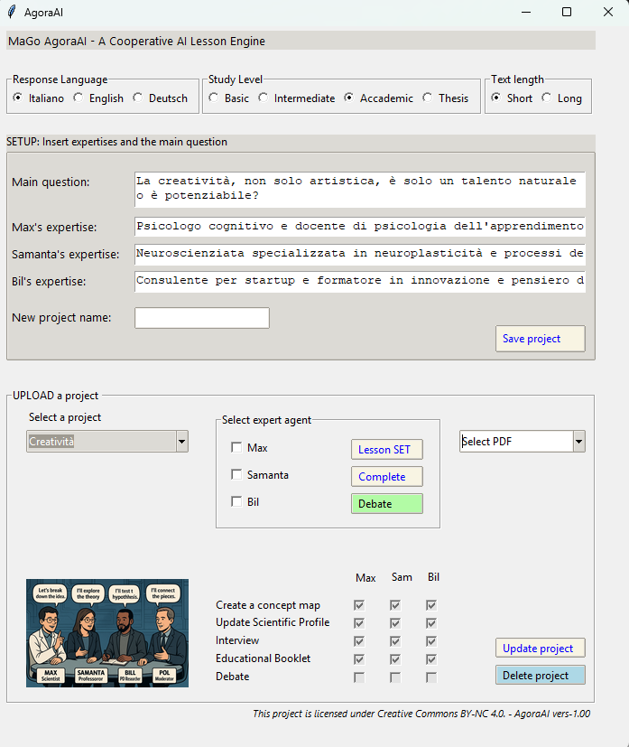

# 🧠 MaGo AgoraAI  
da una domanda genera **mappe concettuali**, **interviste simulate**, **dialoghi interdisciplinari** e **tesi accademiche** 

## 🎯 Il primo motore di dibattiti accademici interdisciplinari generati da IA.
    
    Immagina di chiedere "Cos'è il tempo?" e ottenere in 40 minuti:

        📚 Due tesine magistrali (es.: fisica relativistica vs. filosofia del tempo), complete di bibliografia.

        🗺️ Mappe concettuali che collegano le due discipline.

        ⚡ Un dibattito strutturato dove le IA "interpretano" posizioni opposte, con argomentazioni da conferenza accademica.

## Perché è innovativo?

        🔥 Nessun tool oggi combina ricerca multidisciplinare, sintesi accademica *e* dialettica automatica.

        🚀 Da domanda a paper complesso in meno di un’ora, pronto per revisione umana.

## 🚀 Funzionalità principali

- Creazione guidata di progetti con definizione della domanda iniziale e competenze degli attori.
- Generazione automatica di mappe concettuali (Max e Samanta).
- Valutazione dei contributi tramite un moderatore (Pol).
- Produzione di interviste simulate e dialoghi tra agenti con punti di vista diversi.
- Generazione di testi di livello accademico (tesi, dispense, approfondimenti interdisciplinari).

> ⚙️ **Tecnologie**: Python + [Ollama](https://ollama.com/) + modello Gemma 3 (12B).  
> Compatibile con altri modelli LLM open source di media dimensione.

---

## 🧩 Approccio dialogico

Il cuore di AgoraAI è l’interazione tra **agenti simulati**:

- **Max** – esperto di una disciplina (es. fisica teorica).
- **Samanta** – esperta di un’altra disciplina (es. filosofia).
- **Pol** – moderatore che sintetizza, valuta e guida la discussione.

Questo approccio consente al sistema di **sviluppare elaborati complessi** e **interdisciplinari**, anche con un solo punto di vista definito.

# 🧠 MaGo-AgoraAI

MaGo-AgoraAI è uno strumento progettato per generare mappe concettuali, dialoghi cooperativi, testi accademici e simulazioni educative a partire da una semplice domanda iniziale.  
È pensato per essere **accessibile**, **potente** e **flessibile**, adatto sia per l'apprendimento scolastico che per l'elaborazione avanzata di contenuti.

---

## 📢 Novità sul Rilascio (Release Update)

🎉 **E' ARRIVATA LA PRIMA VERSIONE UFFICIALE COMPLETA DI AGORAAI !!**

<a href="https://drive.google.com/uc?export=download&id=1PS9eNMUcnWsSeSIBwsZooD0pZxIfD5Gf" target="_blank" style="
  display: inline-block;
  padding: 12px 24px;
  background-color: #1a73e8;
  color: white;
  font-size: 16px;
  font-weight: bold;
  border-radius: 8px;
  text-decoration: none;
  box-shadow: 0 4px 6px rgba(0,0,0,0.1);
">
  ⬇ Scarica AgoraAI v1.0
</a>

🟡 In questa fase sarà accessibile con un **numero molto elevato di utilizzi** prima di eventuali limitazioni.

🖼️ Abbiamo pubblicato su GitHub l’immagine dell’interfaccia principale aggiornata.  
📝 A breve sarà disponibile anche un **blog** con esempi, guide pratiche e casi d’uso.

---

## 👀 Anteprima Interfaccia

  
*Interfaccia principale della versione completa in arrivo.*
---

## 📦 Librerie principali

- [Ollama](https://ollama.com/) – per eseguire modelli LLM localmente.
- Librerie Python standard per GUI (es. `tkinter`), file management, PDF, ecc.

---

## 🧪 Esempi d’uso

- Filosofia della mente e fisica quantistica.
- Etica dell’IA e ingegneria informatica.
- Storia e neuroscienze.

L’utente definisce i punti di vista e la domanda iniziale. Il sistema genera automaticamente contenuti coerenti e approfonditi.

---

## 📂 Progetti futuri

- Pubblicazione della versione completa con gestione della memoria del dialogo.
- Integrazione con frontend web.
- Funzioni di personalizzazione avanzata per agenti e domini disciplinari.

---

## 📫 Contatti

Per informazioni, suggerimenti o collaborazioni: [Inserisci qui un contatto o link al tuo profilo

## 🔒 License (CC BY-NC 4.0)

This project is licensed under [Creative Commons BY-NC 4.0](https://creativecommons.org/licenses/by-nc/4.0/).  
Free for non-commercial use with attribution.  
📬 For commercial licensing, please contact the authors.

---

## 🧾 Authors

- **Mauro** – Concept, architecture, implementation  
- **Agostino** – Co-author, epistemic design  

